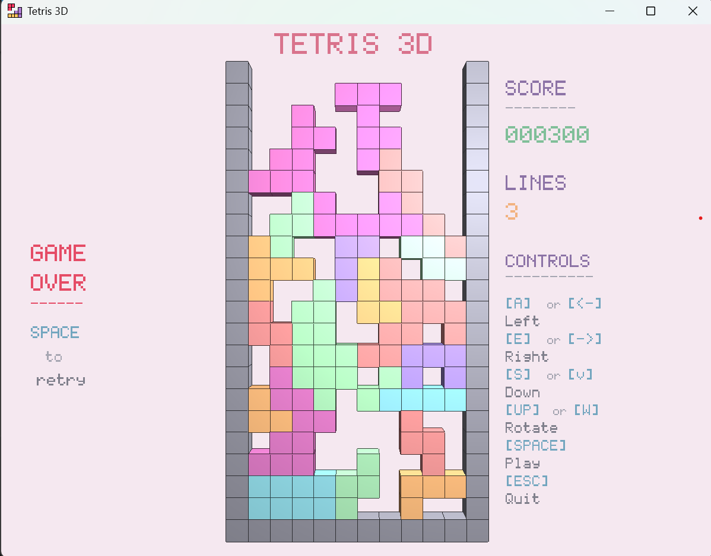
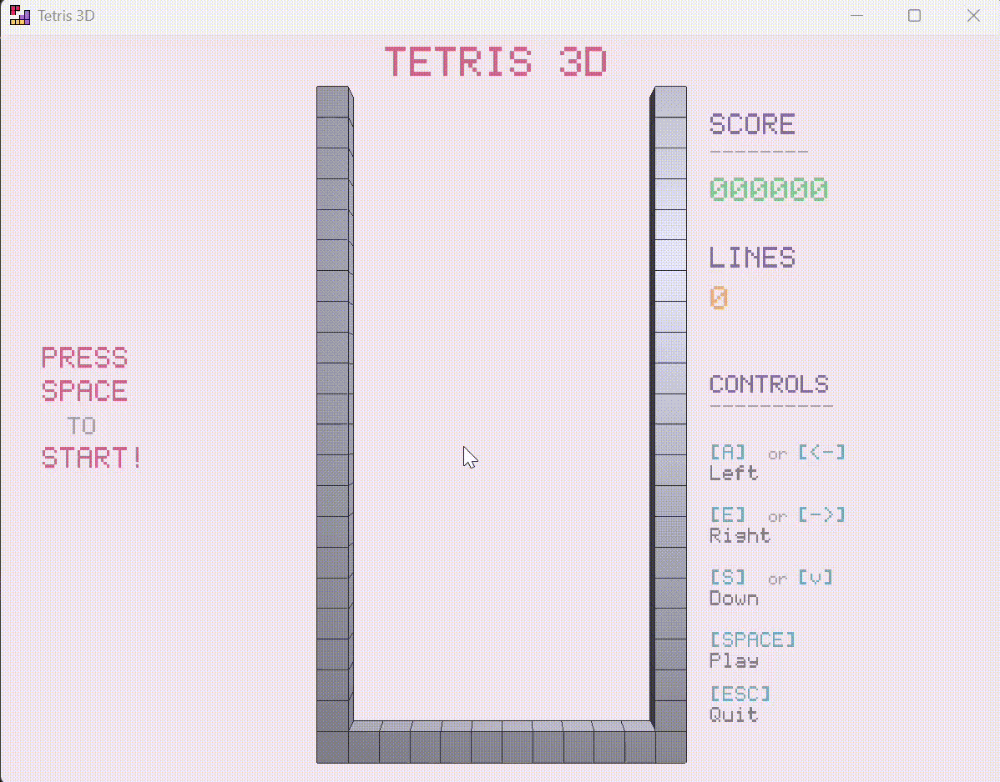

# Tetris 3D 🎮

Une implémentation 3D du jeu classique Tetris construite avec C++, OpenGL et GLFW.

<p align="center">
  
</p>

## 🎬 Vidéo de Démonstration

<p align="center">
  
</p>

## Fonctionnalités

- **Graphismes 3D** - Rendu avec OpenGL utilisant des shaders personnalisés et l'éclairage Phong
- **Gameplay** - Mouvement des pièces en temps réel avec détection de collision
- **Système de Score** - Suivi des points avec bonus pour les lignes effacées
- **Interface Personnalisée** - Rendu de texte basé sur bitmap
- **Contrôles** - Entrée clavier

## Démarrage Rapide

### Prérequis
```bash
# Ubuntu/Debian
sudo apt-get install cmake g++ libglfw3-dev libgl1-mesa-dev

# macOS
brew install cmake glfw

# Windows
# Installer Visual Studio avec le support C++ et CMake
```

### Compilation depuis les Sources
```bash
# Cloner le dépôt
git clone https://github.com/SoukainaNadir/tetries_3D.git
cd tetries_3D

# Initialiser les sous-modules
git submodule update --init --recursive

# Créer le répertoire de build
mkdir build && cd build

# Configurer et compiler
cmake ..
cmake --build .

# Lancer le jeu
./Tetris3D
```

## Contrôles

| Touche | Action |
|--------|--------|
| <kbd>ESPACE</kbd> | Démarrer / Recommencer |
| <kbd>A</kbd> ou <kbd>←</kbd> | Déplacer à gauche |
| <kbd>E</kbd> ou <kbd>→</kbd> | Déplacer à droite |
| <kbd>S</kbd> ou <kbd>↓</kbd> | Chute rapide |
| <kbd>ÉCHAP</kbd> | Quitter |

## Structure du Projet
```
Tetris3D/
├── 📂 src/
│   ├── main.cpp              # Point d'entrée et boucle de jeu
│   ├── Board.cpp             # Plateau de jeu et logique
│   ├── Piece.cpp             # Pièces Tetromino
│   ├── Cube.cpp              # Primitive 3D cube
│   ├── TextRenderer.cpp      # Système de police bitmap
│   └── glad.c                # Chargeur OpenGL
├── 📂 include/
│   ├── Board.h
│   ├── Camera.h
│   ├── Piece.h
│   ├── Cube.h
│   ├── TextRenderer.h
│   └── stb_image.h
├── 📂 shaders/
│   ├── vertex_shader.glsl
│   └── fragment_shader.glsl
├── 📂 external/
│   ├── glfw/                 # Sous-module Git
│   └── glm/                  # Sous-module Git
├── 📄 CMakeLists.txt
├── 📄 README.md
└── 🖼️ icon.png
```

## Architecture

### Composants Principaux

#### `Board` - Gestionnaire de Jeu
- Machine à états du jeu (attente → en cours → game over)
- Détection et validation des collisions
- Algorithme d'effacement des lignes
- Calcul du score
- Coordinateur de rendu

#### `Piece` - Logique des Tetrominos
- 6 types de pièces (I, T, S, Z, J, L)
- Mouvement et positionnement


#### `Cube` - Primitive 3D
- Modèle d'éclairage Phong (ambiant, diffus, spéculaire)
- Rendu des arêtes pour plus de clarté visuelle
- Couleurs configurables

#### `TextRenderer` - Système d'Interface
- Police bitmap personnalisée 5×7
- Support ASCII (32-122)
- Superposition orthographique

### Boucle de Jeu

1. **Apparition** - Une nouvelle pièce apparaît en haut au centre
2. **Chute** - La pièce descend automatiquement
3. **Vérification de Collision** - Validation contre les limites et les pièces verrouillées
4. **Verrouillage** - La pièce devient partie du plateau
5. **Effacement des Lignes** - Suppression des lignes horizontales complètes
6. **Score** - Attribution des points (100 par ligne, ×2 pour plusieurs)
7. **Répétition** ou **Game Over**


### Dimensions du Plateau

Modifier `include/Board.h` :
```cpp
static const int FIELD_WIDTH = 10;   // Largeur du plateau
static const int FIELD_HEIGHT = 20;  // Hauteur du plateau
```

### Couleur de Fond

Modifier `src/main.cpp` :
```cpp
glClearColor(0.96f, 0.91f, 0.94f, 1.0f);  // Valeurs RGB
```

## Stack Technique

| Technologie | Utilité |
|-------------|---------|
| **C++17** | Langage principal |
| **OpenGL 3.3+** | Rendu graphique |
| **GLFW** | Gestion des fenêtres et entrées |
| **GLM** | Bibliothèque mathématique |
| **GLAD** | Chargeur de fonctions OpenGL |
| **CMake** | Système de build |
| **stb_image.h** | Chargement d'icône |

## Configuration des Dépendances

### Ajout des Sous-modules

Si vous clonez depuis zéro, les sous-modules sont déjà configurés. Pour ajouter manuellement :
```bash
git submodule add https://github.com/glfw/glfw.git external/glfw
git submodule add https://github.com/g-truc/glm.git external/glm
```

### Installation Manuelle

Alternativement, téléchargez les bibliothèques manuellement :
- [GLFW](https://www.glfw.org/download.html)
- [GLM](https://github.com/g-truc/glm/releases)
- [GLAD](https://glad.dav1d.de/) - Déjà inclus dans `src/glad.c`


## Contact

NADIR Soukaina - soukainanadir33@gmail.com

Lien du Projet : (https://github.com/SoukainaNadir/tetries_3D.git)


---

Made with ❤️ et C++
